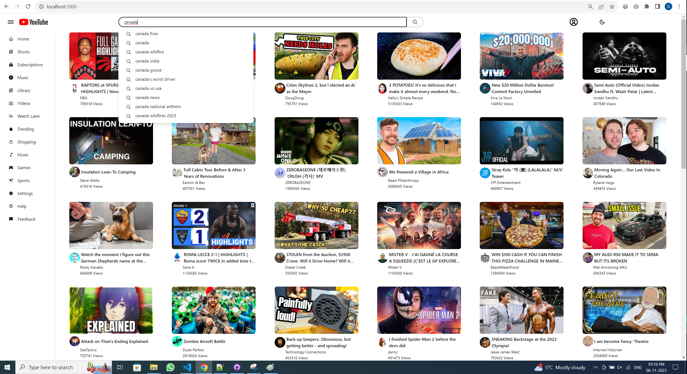

# MyTube - Simple yet powerful React based clone of YouTube.

### Technologies Used

- React: Primary front-end library.
- Redux: State management.
- React Router: Routing within the application.
- Parcel: Project Bundler.
- Babel: Transcompiler for modern JavaScript.
- Tailwind: CSS Library

## Project Structure

The project's codebase is organized as follows:

- `src/`: This directory contains the source code for the project.
  - `App.js`: The main application component.
  - `index.js`: The entry point of the application.
  - `components/`: Various components used in the project, each documented with comments explaining its functionality.

## Prerequisite: Google API Key

You can obtain your own Google API key for this project from Google Developer Console

## Getting Started

To run this project locally, follow these steps:

1. Clone the repository.
2. Run command: `npm install`
3. Run command: `npm start`

## Few snippets

### Home Page

### Home Page (Dark Mode)

### Search Suggestions

### Search Results

### Sidebar Closed

### Infinite Scroll while scrolling down

### Watch Page and Recommendations

